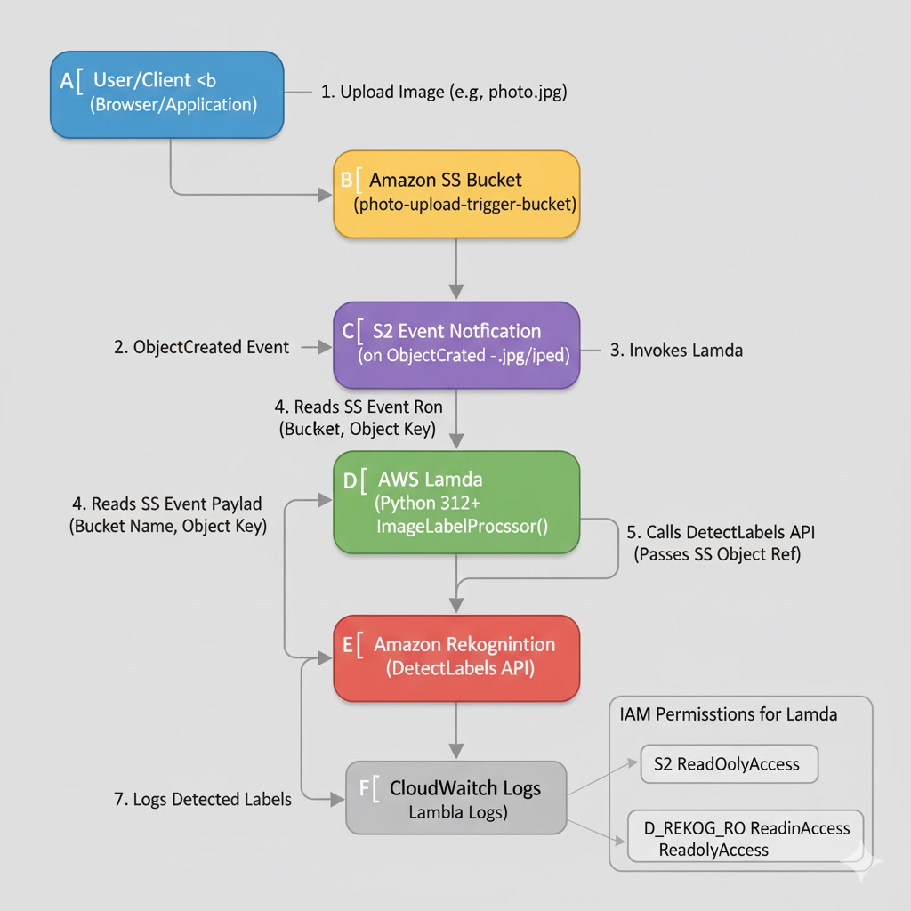

## Photo Upload System (Event-Driven AI Processing)

This project demonstrates a robust, serverless, and event-driven pipeline that automatically processes images uploaded by users using Amazon Rekognition for object and scene recognition. The solution is fully automated, triggering computation immediately upon storage.

## Architecture and Data Flow

The architecture is centered around S3 Event Notifications, ensuring that the Lambda function is invoked only when a new image file is successfully stored.

    S3 Bucket: Acts as the entry point and the Event Source.

    S3 Event Notification: Automatically sends a trigger event to the Lambda function on every ObjectCreate event (file upload).

    AWS Lambda (Python): The event handler. It reads the file metadata from the S3 event, calls Rekognition, and logs the resulting labels.

    Amazon Rekognition: The high-level AI service that analyzes the image and returns a list of detected objects (labels) and their confidence scores.

Architecture Diagram:

## Key Technical Achievements

This project showcases critical modern cloud computing skills:

    Event-Driven Programming: Mastered the configuration of S3 Bucket Notifications to create a fully automated trigger, eliminating the need for polling or manual invocation.

    AI Service Integration: Successfully implemented the Boto3 Python client within Lambda to call the Amazon Rekognition DetectLabels API, proving the ability to integrate advanced AI functionality into backend workflows.

    Cross-Service IAM: Ensured correct IAM permissions by granting the Lambda Execution Role both S3 read access (to get the file) and Rekognition invocation access (to perform analysis).

    Workflow Validation: Verified the entire pipeline integrity by uploading a test image and confirming the resulting object labels via CloudWatch Logs, demonstrating a reliable process for visual content analysis.

## Visual Documentation Checklist

    S3 Trigger Configuration:

    CloudWatch Proof of Work:

